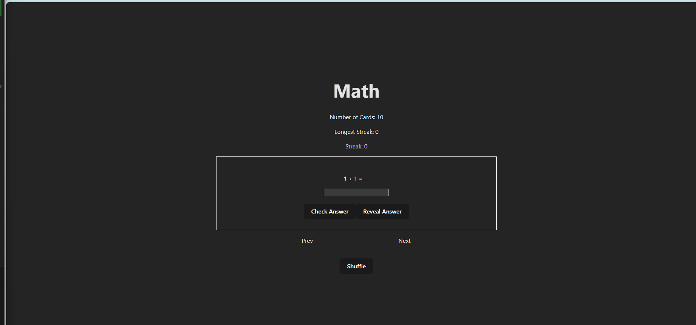

# Web Development Project 3 - *Math FlashCards Part 2*

Submitted by: **Leon Fong**

This web app: **Math FlashCards Upgraded*

Time spent: **10 hours** hours spent in total

## Required Features

The following **required** functionality is completed:

- [X] **The user can enter their guess in a box before seeing the flipside of the card**
- [X] **Clicking on a submit button shows visual feedback about whether the answer was correct or incorrect**
- [X] **A back button is displayed on the card and can be used to return to the previous card in a set sequence**
- [X] **A next button is displayed on the card and can be used to navigate to the next card in a set sequence**

The following **optional** features are implemented:

- [X] A shuffle button is used to randomize the order of the cards
- [ ] A user's answer may be counted as correct even when it is slightly different from the target answer
- [X] A counter displays the user's current and longest streak of correct responses
- [ ] A user can mark a card that they have mastered and have it removed from the pool of answers as well as added to a list of mastered cards

The following **additional** features are implemented:

* [x] Locking feature where the answer cannot be revealed until a guess has been made
* [x] The Reveal button changes show question when revealing the answer (The test toggles)
* [x] Streak counter only goes up once after answering the question correctly until another card is shown (prevents spamming the same card to increase streak)

## Video Walkthrough

Here's a walkthrough of implemented user stories:

<!-- Replace this with whatever GIF tool you used! -->
GIF created with ...  
<!-- Recommended tools:
[Kap](https://getkap.co/) for macOS
[ScreenToGif](https://www.screentogif.com/) for Windows
[peek](https://github.com/phw/peek) for Linux. -->

## Notes

Learning how to use useState, useEffect, and making it work with input into the website

## License

    Copyright [2025] [Leon Fong]

    Licensed under the Apache License, Version 2.0 (the "License");
    you may not use this file except in compliance with the License.
    You may obtain a copy of the License at

        http://www.apache.org/licenses/LICENSE-2.0

    Unless required by applicable law or agreed to in writing, software
    distributed under the License is distributed on an "AS IS" BASIS,
    WITHOUT WARRANTIES OR CONDITIONS OF ANY KIND, either express or implied.
    See the License for the specific language governing permissions and
    limitations under the License.
